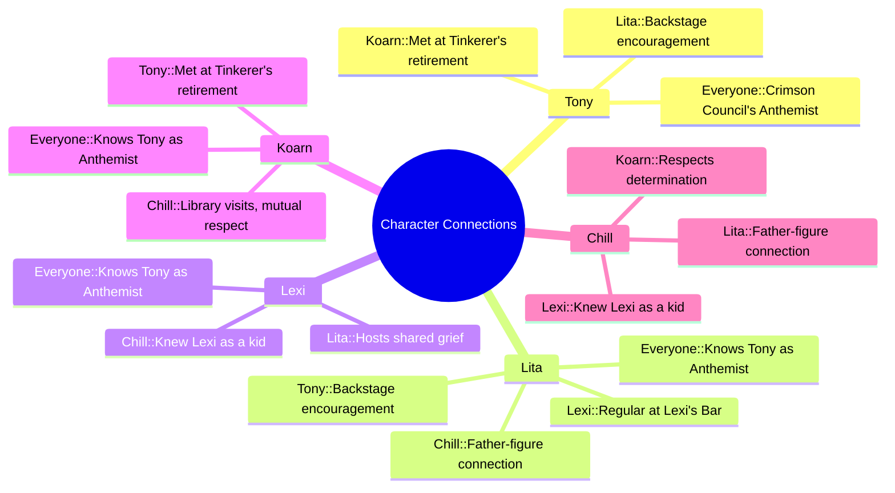

---
{"dg-publish":true,"permalink":"/fantasy/players-linkz/","tags":["dg-home"]}
---

[[Fantasy/Tony\|Tony]]
[[Fantasy/Lexi\|Lexi]]
## Setting Rules

| Rule                      | Description                                                                                                                    |
| ------------------------- | ------------------------------------------------------------------------------------------------------------------------------ |
| **Conviction**            | Earned through triumph or tragedy. Each token adds a d6 to Trait and damage rolls for one round. Can be extended with a Benny. |
| **Dynamic Backlash**      | A Critical Failure on an arcane skill roll triggers a chaotic effect from a special table.                                     |
| **Gritty Damage**         | Wild Cards roll on the Injury Table when wounded.                                                                              |
| **Hard Choices**          | Players must make difficult decisions that challenge their morals, loyalties, or goals.                                        |
| **Difficult Healing**     | Healing is limited to one attempt per wound. Failed attempts or wounds older than an hour can't be healed.                     |
| **Villainous Conviction** | Villains may earn Conviction tokens for dramatic setbacks or triumphs, just like heroes.                                       |
| **Wound Cap**             | Wild Cards can't take more than four wounds from a single hit.                                                                 |
| **Fanatics**              | Enemy thugs may absorb damage meant for their masters.                                                                         |

## Character Connections

| Character                                        | Connections                                                                                                                                                                                                                                                                 |
| ------------------------------------------------ | --------------------------------------------------------------------------------------------------------------------------------------------------------------------------------------------------------------------------------------------------------------------------- |
| **Tony** - Crimson Council's official anthemist. | Spends time backstage with Lita during government announcements. Encouraged by Lita to put "heart and emotion" into her performances. Met Koarn after a Tinkerer's retirement ceremony performance. Known by everyone as the Crimson Council's official anthemist. |
| **Lita** - Council Voice Barer                   | Backstage with Tony during official announcements. Encourages Tony to add emotion to her singing. Knows Chill, a friend of her father and father-figure. Regular at Lexi's Bar, where she commiserates over deteriorating fathers.                                 |
| **Lexi** - Owner Of the Bronze Buck Tavern       | Knew Chill as a kid; he still visits the bar. Hosts Lita and others at her bar to share grief over their fathers. Knows Tony as the Crimson Council's anthemist.                                                                                                      |
| **Koarn** - Apprentice to the Tinkerer           | Met Tony after her performance at a retirement ceremony. Checks out books at Chill’s library; Chill respects his determination. Knows Tony as the Crimson Council's anthemist.                                                                                        |
| **Chill** - Librarian                            | Knew Lexi as a kid; still visits her bar. Works at the library Koarn frequents; respects Koarn’s determination. Friend of Lita’s father; has taken on a father-figure role.                                                                                           |

- **Virehold:** Isadora's Apothecary
    
- **Stonegate:** The Museum of National Glory
    
- **Hollowmere:** Bud's Bits
    
- **Gravemarket:** Lazy Tree Brewery
    
- **Ashveil:** Gloamspire Hall
    

---

## 🍺 Irene Glass — The Tavernkeeper Thief

Owner of the Bronze Buck Tavern in Gravemarket, Irene is a fiercely loyal woman with shoulder-length onyx hair and dark blue eyes. She stands 5'7" with a slender frame and has run the tavern since inheriting it from her father. Though beloved by the people of Hallowspire, Irene struggles to keep the business afloat.

- **Public Role**: Tavern owner, caretaker of her aging father
    
- **Private Truth**: Moonlights as a thief targeting the wealthy
    
- **Skills**: Agile, deadly with a shortbow, quick in a brawl
    
- **Motivation**: Keep the tavern open, protect her family
    
- **Asset**: Access to local gossip, fencing network
    

Her brother Thomas vanished mysteriously, leaving her to manage the tavern alone. Though thievery is outlawed, Irene finds freedom and purpose in her moonlit heists. She uses the profits to support her staff and maintain the tavern, even hiring bards like Myra Brightnote to keep spirits high.

### Connections:
    
    - Knew Chill as a kid; he still visits the bar
        
    - Hosts Lita and others at her bar to share grief over their fathers
        
    - Knows Tony as the Crimson Council's anthemist
---

## 📣 Cassandra Vale — Voice Bearer of the Council
Born into the pale-blooded Vale family, Cassandra was marked by beauty and suspicion. Her brother’s death — a Council sacrifice — was no accident. She spoke out, was punished, and now serves High Executor Thorne as a symbol of reformed obedience.

- **Public Role**: Dutiful Mouthpiece for the Crimson Council
    
- **Private Truth**: Scarred survivor, quiet rebel
    
- **Asset**: Sutter Cain’s sketchbook, found tucked into her coat after a routine inspection
    
Behind her eyepatch, rebellion simmers. Her loyalty is a mask, and her mind is sharp with defiance.
### Connections:
    
    - Backstage with Tony during official announcements
        
    - Encourages Tony to add emotion to her singing
        
    - Knows Chill, a friend of her father and father-figure
        
    - Regular at Lexi's Bar, where she commiserates over deteriorating father
---

## 🎶 Elira Graysong — The Voice on the Edge

Raised in Ashveil’s Gloamspire Hall, Elira sings the Anthem with haunting clarity. Loyal to the Crimson Council, yet haunted by her grandmother’s forbidden songs and a vision in the fog.

- **Public Role**: Model anthemist
    
- **Private Truth**: Empathetic, conflicted, grieving
    
- **Asset**: Memory of the forbidden melody
    

Elira’s grandmother, Selyne Graysong, was a former anthemist who secretly hummed forbidden melodies and spoke of a freer Hallowspire. She believed the forest fog carried the voices of the departed.

After Selyne’s death and the Graveyard Ban, Elira was heartbroken. One misty night, she saw Selyne’s silhouette in the fog, mouthing silent words.

To the Council, Elira is a loyal anthemist. To the rebellion, she may become a voice of freedom.

### - **Connections**:
    
    - Met Tony after her performance at a Tinkerer's retirement ceremony
        
    - Checks out books at Chill’s library; Chill respects his determination
        
    - Knows Tony as the Crimson Council's anthemist

---

## 🛠️ Koarn — The Quiet Builder

Orphaned by Council secrets, Koarn works in a tech shop repairing constructs. Tall, quiet, and distrustful of authority.

- **Height**: 6'6"
    
- **Goal**: Learn all he can before leaving to seek lost knowledge
    
- **Crush**: Redhead at the bits shop
    
- **Asset**: Access to government tech and repair networks
    

###  **Connections**:
    
    - Spends time backstage with Lita during government announcements
        
    - Encouraged by Lita to put "heart and emotion" into her performances
        
    - Met Koarn after a Tinkerer's retirement ceremony performance
        
    - Known by Lexi, owner of the Bronze Buck Tavern