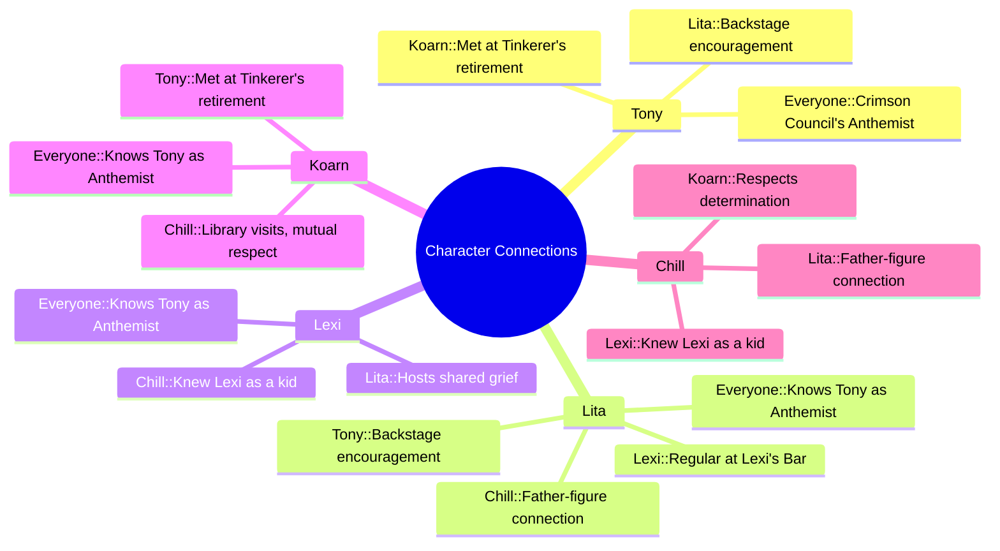

---
{"dg-publish":true,"permalink":"/fantasy/players-linkz/","tags":["#dg-home"]}
---

[[Fantasy/Tony\|Tony]]
[[Lexi\|Lexi]]
## Setting Rules

| Rule                      | Description                                                                                                                    |
| ------------------------- | ------------------------------------------------------------------------------------------------------------------------------ |
| **Conviction**            | Earned through triumph or tragedy. Each token adds a d6 to Trait and damage rolls for one round. Can be extended with a Benny. |
| **Dynamic Backlash**      | A Critical Failure on an arcane skill roll triggers a chaotic effect from a special table.                                     |
| **Gritty Damage**         | Wild Cards roll on the Injury Table when wounded.                                                                              |
| **Hard Choices**          | Players must make difficult decisions that challenge their morals, loyalties, or goals.                                        |
| **Difficult Healing**     | Healing is limited to one attempt per wound. Failed attempts or wounds older than an hour can't be healed.                     |
| **Villainous Conviction** | Villains may earn Conviction tokens for dramatic setbacks or triumphs, just like heroes.                                       |
| **Wound Cap**             | Wild Cards can't take more than four wounds from a single hit.                                                                 |
| **Fanatics**              | Enemy thugs may absorb damage meant for their masters.                                                                         |

## Character Connections

| Character                                       | Connections                                                                                                                                                                                                                                                                 |
| ----------------------------------------------- | --------------------------------------------------------------------------------------------------------------------------------------------------------------------------------------------------------------------------------------------------------------------------- |
| **Tony** - Crimson Council's official anthemist | Spends time backstage with Lita during government announcements. Encouraged by Lita to put "heart and emotion" into her performances. Met Koarn after a Tinkerer's retirement ceremony performance. Known by everyone as the Crimson Council's official anthemist. |
| **Lita** - Council Voice Barer                  | Backstage with Tony during official announcements. Encourages Tony to add emotion to her singing. Knows Chill, a friend of her father and father-figure. Regular at Lexi's Bar, where she commiserates over deteriorating fathers.                                 |
| **Lexi** - Owner Of the Bronze Buck Tavern      | Knew Chill as a kid; he still visits the bar. Hosts Lita and others at her bar to share grief over their fathers. Knows Tony as the Crimson Council's anthemist.                                                                                                      |
| **Koarn** - Apprentice to the Tinkerer          | Met Tony after her performance at a retirement ceremony. Checks out books at Chill’s library; Chill respects his determination. Knows Tony as the Crimson Council's anthemist.                                                                                        |
| **Chill** - Librarian                           | Knew Lexi as a kid; still visits her bar. Works at the library Koarn frequents; respects Koarn’s determination. Friend of Lita’s father; has taken on a father-figure role.                                                                                           |

- **Virehold:** Isadora's Apothecary
    
- **Stonegate:** The Museum of National Glory
    
- **Hollowmere:** Bud's Bits
    
- **Gravemarket:** Lazy Tree Brewery
    
- **Ashveil:** Gloamspire Hall
    

---

### **Characters & Businesses**

#### **(Lylita)**
Whispering Woods

#### **(The Chillustrator)**
[[Fantasy/The Crater/Hellspire Peak\|Hellspire Peak]]

#### **(Koarn)**
[[Fantasy/The Crater/Stilldeep Caverns\|Stilldeep Caverns]]
[[Fantasy/The Crater/Town/Cities and Sectors/Echo Vault\|Echo Vault]]

## **(hexii)**

#### **(Tony Marinara)**
[[Fantasy/The Crater/Sutter Commune\|Sutter Commune]]
