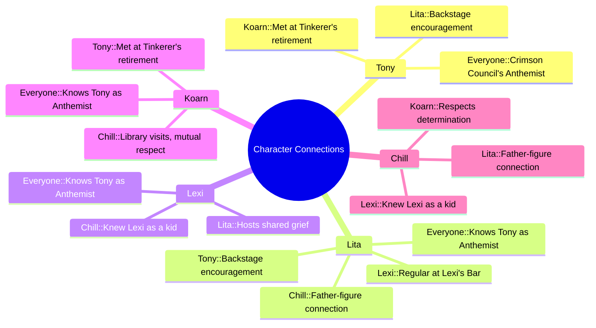

---
{"dg-publish":true,"permalink":"/fantasy/players-linkz/","tags":["#dg-home"]}
---

[[Fantasy/Tony\|Tony]]
[[Lexi\|Lexi]]

GRITTY DAMAGE: When Wild Cards take a Wound, they roll on the Injury Table and apply the results

COMMON SETTING RULES: Conviction, Dynamic Backlash, Gritty Damage, Hard Choices, High Adventure, Villainous Conviction

DYNAMIC BACKLASH: A Critical Failure on an arcane skill roll forces the player to roll on a special table with various chaotic results.

CONVICTION: Heroes gain Conviction Tokens that can be used to add a d6 to all Trait and damage rolls for one round. Conviction is awarded for triumph (overcoming a great obstacle important to that character), and tragedy (a personal setback, death of a friend or ally, etc). Conviction effects may be extended by spending a Benny

WOUND CAP: Wild Cards never suffer more than four wounds from a single hit.
O FANATICS: Enemy thugs may take the damage for their masters

# DIFFICULT HEALING

It's fairly easy to keep a party at full strength if one or two members have healing powers. In a realistic, gritty, or dark fantasy game, you can make healing more difficult without getting rid of it entirely. Constant penalties aren't much fun for players!

If this setting rule is used, a caster only has **one chance to heal a particular wound.** A healer can attempt to heal any new wounds as they occur, but the power doesn't affect any wounds it already failed to improve or that are over an hour old.

!!!!**Example:** Red is shot by an orc's arrow and suffers two wounds. Gabe attempts to heal her and removes one. Later on, Red is bitten by a giant spider and suffers another wound. She now has two wounds: one from the orc and one from the spider. Gabe has already attempted to heal the arrow wound, so he can't heal that one, even if he gets a raise on his healing roll. However, he can try to remove the wound from the spider bite as usual.

### **Districts & Locations**

- **Virehold:** Isadora's Apothecary
    
- **Stonegate:** The Museum of National Glory
    
- **Hollowmere:** Bud's Bits
    
- **Gravemarket:** Lazy Tree Brewery
    
- **Ashveil:** Gloamspire Hall
    

---

### **Characters & Businesses**

#### **(Lylita)**
Whispering Woods

#### **(The Chillustrator)**
[[Fantasy/The Crater/Hellspire Peak\|Hellspire Peak]]

#### **(Koarn)**
[[Fantasy/The Crater/Stilldeep Caverns\|Stilldeep Caverns]]
[[Fantasy/The Crater/Town/Cities and Sectors/Echo Vault\|Echo Vault]]

## **(hexii)** - not sick dad in woods memories "i told ya shes smarter than me and better lookin'!"
[[Fantasy/The Crater/Town/Cities and Sectors/Crypt\|Crypt]]

#### **(Tony Marinara)**
[[Fantasy/The Crater/Sutter Commune\|Sutter Commune]]
